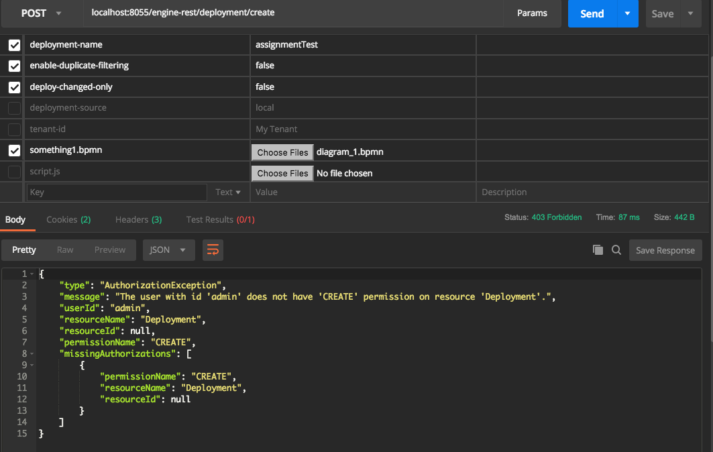

# camunda-rest-jwt-authentication
Camunda BPM plugin library providing JWT Authentication


TODO: Write how this all works!!


# Screenshots of usage

Postman Result:




JWT Config:


# Example usages

# Tomcat Docker

1. Set your password/key/secret in the `./examples/docker/tomcat/docker/keys/key.pub` file.
1. In Terminal, go to: `examples/docker/tomcat`, and run `docker-compose up`
1. Go to `localhost:8055/camunda` and create a admin user
1. Go to jwt.io and use the "Debugger" to create a JWT token:  The payload should look like
    ```json
    {
      "sub": "...",
      "username": "admin",
      "groupIds": ["camunda-admin"],
      "tenantIds": [],
      "iat": ....
    }
    ```
    Lead the sub and iat values as their default values that are provided by jwt.io.
1. set the secret on the bottom right of the jwt.io page to the secret that is in the key.pub file that you set in the previous step.
1. Copy the encoded token on the left of the jwt.io page
1. In Postman (getpostman.com) in your request to the camunda api, go to the Authentication tab and paste the copied token in the Bearer token field:
    
1. Execute the request.

If you want to see what happens when you get a access denied, change remove the admin group from the `groupIds` field