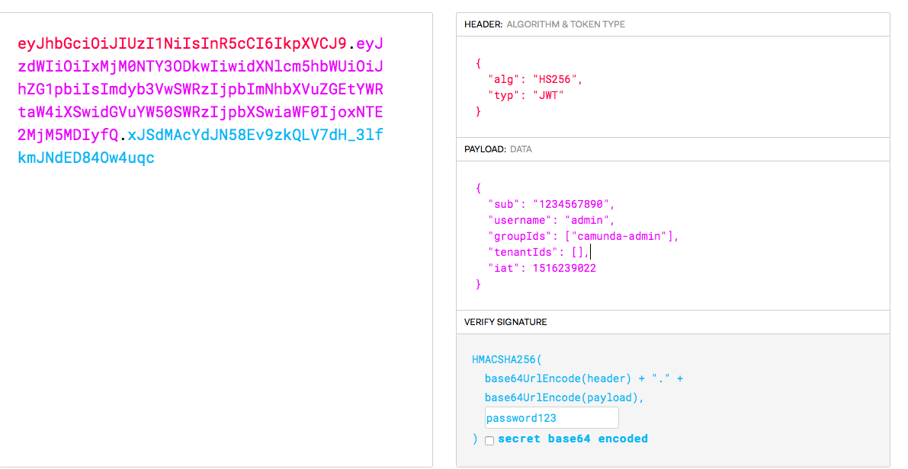

# Camunda JWT REST API Validation Provider

Provides a JWT Validation provider for Camunda BPM's REST API.

This JWT provider is designed only to validate JWT tokens and inject the Username, Group IDs, and Tenant IDs 
that the username is part of.  The provider does **not** issue JWT tokens during the login process.

Groups in Camunda are used for controlling the access.  You will need to define groups with accesses.
If you are working with Camunda as a generic microservice and do not need accesses, other than the master 
user/admin user, then use the group `camunda-admin`, which is the default admin group.

# How it works

This provider is added into the Camunda's engine-rest application which is the Rest API for Camunda BPM.

A Servlet Filter is added into the engine-rest app which will process requests in the JWT Authentication provider.

Two initialization parameters of the filter are provided for easy customization:

1. `jwt-secret-path` : The file path to a file containing the JWT secret used to decode/validate the JWT.  The value can be null if you get your secret from a different source.
1. `jwt-validator` : The fully qualified class name of the class that will validate the JWT.

It is expected that the JWT is using the standard `Authorization` header with the format `Bearer theJwtTokenHere` 


# Included JWT Validation Library

By default the java-jwt library is included: https://github.com/auth0/java-jwt
You can use this library to in your Validator class.


# Screenshots of usage

Postman Result for a valid JWT but the user does not have the proper group authorizations for access:


JWT Config:



# Example usages

# Tomcat Docker

1. Set your password/key/secret in the `./examples/docker/tomcat/docker/keys/key.pub` file.
1. In Terminal, go to: `examples/docker/tomcat`, and run `docker-compose up`
1. Go to `localhost:8055/camunda` and create a admin user
1. Go to jwt.io and use the "Debugger" to create a JWT token:  The payload should look like
    ```json
    {
      "sub": "...",
      "username": "admin",
      "groupIds": ["camunda-admin"],
      "tenantIds": [],
      "iat": ....
    }
    ```
    Lead the sub and iat values as their default values that are provided by jwt.io.
1. set the secret on the bottom right of the jwt.io page to the secret that is in the key.pub file that you set in the previous step.
1. Copy the encoded token on the left of the jwt.io page
1. In Postman (getpostman.com) in your request to the camunda api, go to the Authentication tab and paste the copied token in the Bearer token field:
    
1. Execute the request.

If you want to see what happens when you get a access denied, change remove the admin group from the `groupIds` field

# How to install

If you are building a Spring Boot or generating a JAR wth camunda, you can install the library as follows:

Add JitPack as a repository source in your build file.

If you are using Maven, then add the following to your pom.xml

```xml
<project>
...
    <repositories>
        <repository>
            <id>jitpack.io</id>
            <url>https://jitpack.io</url>
        </repository>
    </repositories>
...
```

This snippet will enable Maven dependency download directly from Github.com

Then add the following dependency:

```xml
...
 <dependency>
    <groupId>com.github.digitalstate</groupId>
    <artifactId>camunda-rest-jwt-authentication</artifactId>
    <version>v0.5</version>
    <scope>compile</scope>
 </dependency>
```

If you are using a existing Docker Container with Camunda / the Shared Engine configuration of Camunda, and you would like to add JWT see:

1. Tomcat: [`./examples/docker/tomcat`](./examples/docker/tomcat)


# Tomcat Servlet Filter Configuration

Using the JWT filter with Tomcat is added into the web.xml of the engine-rest app.

If you are using the Shared engine and working with the default docker container of Camunda BPM tomcat, you can override the container such as:

Dockerfile:

```dockerfile
FROM camunda/camunda-bpm-platform:tomcat-7.9.0

RUN rm -r webapps/camunda-invoice

COPY docker/camunda/conf/bpm-platform.xml /camunda/conf/bpm-platform.xml

COPY docker/camunda/webapps/engine-rest/WEB-INF/lib/camunda-rest-api-jwt-authentication-v0.5-jar-with-dependencies.jar /camunda/webapps/engine-rest/WEB-INF/lib/camunda-rest-api-jwt-authentication-v0.5-jar-with-dependencies.jar
COPY docker/camunda/webapps/engine-rest/WEB-INF/web.xml /camunda/webapps/engine-rest/WEB-INF/web.xml

# Example usage of a standalone jar with the jwt validator class that is extended from the camunda-rest-api-jwt-authentication jar.
COPY docker/camunda/webapps/engine-rest/WEB-INF/lib/example-custom-jwt-validator-v1.0.jar /camunda/webapps/engine-rest/WEB-INF/lib/example-custom-jwt-validator-v1.0.jar
COPY docker/keys/key.pub /keys/key.pub
```

:exclamation: In practice the key.pub file would be stored in a Docker Volume

In the web.xml file, the following servlet filter is added:

```xml
...
<filter>
        <filter-name>camunda-jwt-auth</filter-name>
        <filter-class>
            io.digitalstate.camunda.authentication.jwt.ProcessEngineAuthenticationFilterJwt
        </filter-class>
        <async-supported>true</async-supported>
        <init-param>
            <param-name>authentication-provider</param-name>
            <param-value>io.digitalstate.camunda.authentication.jwt.AuthenticationFilterJwt</param-value>
        </init-param>
        <init-param>
            <param-name>jwt-secret-path</param-name>
            <!--Replace value with absolute path to file that stores the JWT secret-->
            <param-value>/keys/key.pub</param-value>
        </init-param>
        <init-param>
            <param-name>jwt-validator</param-name>
            <!--Replace the value with your Class that extends AbstractValidatorJwt-->
            <param-value>io.digitalstate.camunda.custom.jwt.ValidatorJwt</param-value>
        </init-param>
    </filter>
    <filter-mapping>
        <filter-name>camunda-jwt-auth</filter-name>
        <url-pattern>/*</url-pattern>
    </filter-mapping>
...

```


# Camunda Spring Boot Servlet Filter Configuration

Using the JWT filter with Spring boot, is very easy to implement.

Implement your Validator class as you would, and add and configured the following `@Configuration` class into your Spring Boot application:

```java
@Configuration
public class CamundaSecurityFilter {

    @Value('${camunda.rest-api.jwt.secret-path}')
    String jwtSecretPath;

    @Value('${camunda.rest-api.jwt.validator-class}')
    String jwtValidatorClass;

    @Bean
    public FilterRegistrationBean processEngineAuthenticationFilter() {
        FilterRegistrationBean registration = new FilterRegistrationBean();
        registration.setName("camunda-jwt-auth");
        registration.addInitParameter('authentication-provider', 'io.digitalstate.camunda.authentication.jwt.AuthenticationFilterJwt');
        registration.addInitParameter('jwt-secret-path', jwtSecretPath);
        registration.addInitParameter('jwt-validator', jwtValidatorClass);
        registration.addUrlPatterns("/rest/*");
        registration.setFilter(getProcessEngineAuthenticationFilter());
        return registration;
    }

    @Bean
    public Filter getProcessEngineAuthenticationFilter() {
        return new ProcessEngineAuthenticationFilterJwt();
    }
}
```

In this example we are using Spring external configuration to get the values of the secret Path and the Validator Class name.

Feel free to reconfigure the usage as you see fit.


# Validation Class Example

This is a example of a groovy based Validator class that would used to validate a JWT.

```groovy
package io.digitalstate.camunda.custom.jwt

import com.auth0.jwt.JWT
import com.auth0.jwt.JWTVerifier
import com.auth0.jwt.algorithms.Algorithm
import com.auth0.jwt.exceptions.JWTVerificationException
import com.auth0.jwt.interfaces.DecodedJWT
import io.digitalstate.camunda.authentication.jwt.AbstractValidatorJwt
import io.digitalstate.camunda.authentication.jwt.ValidatorResultJwt
import org.slf4j.Logger
import org.slf4j.LoggerFactory
import groovy.transform.CompileStatic

@CompileStatic
public class ValidatorJwt extends AbstractValidatorJwt {

    private static final Logger LOG = LoggerFactory.getLogger(ValidatorJwt.class)
    private static String jwtSecret

    @Override
    ValidatorResultJwt validateJwt(String encodedCredentials, String jwtSecretPath) {
        if (!jwtSecret){
            try {
                jwtSecret = new FileInputStream(jwtSecretPath).getText()
            } catch(all){
                LOG.error("ERROR: Unable to load JWT Secret: ${all.getLocalizedMessage()}")
                return ValidatorResultJwt.setValidatorResult(false, null, null, null)
            }
        }

        try {
            Algorithm algorithm = Algorithm.HMAC256(jwtSecret);
            JWTVerifier verifier = JWT.require(algorithm)
                .acceptNotBefore(new Date().getTime())
                .build();
            DecodedJWT jwt = verifier.verify(encodedCredentials)

                String username = jwt.getClaim('username').asString()
                List<String> groupIds = jwt.getClaim('groupIds').asList(String)
                List<String> tenantIds = jwt.getClaim('tenantIds').asList(String)

                if (!username){
                    LOG.error("BAD JWT: Missing username")
                    return ValidatorResultJwt.setValidatorResult(false, null, null, null)
                }

            return ValidatorResultJwt.setValidatorResult(true, username, groupIds, tenantIds)

        } catch(JWTVerificationException exception){
            LOG.error("BAD JWT: ${exception.getLocalizedMessage()}")
            return ValidatorResultJwt.setValidatorResult(false, null, null, null)
        }
    }

}
```

